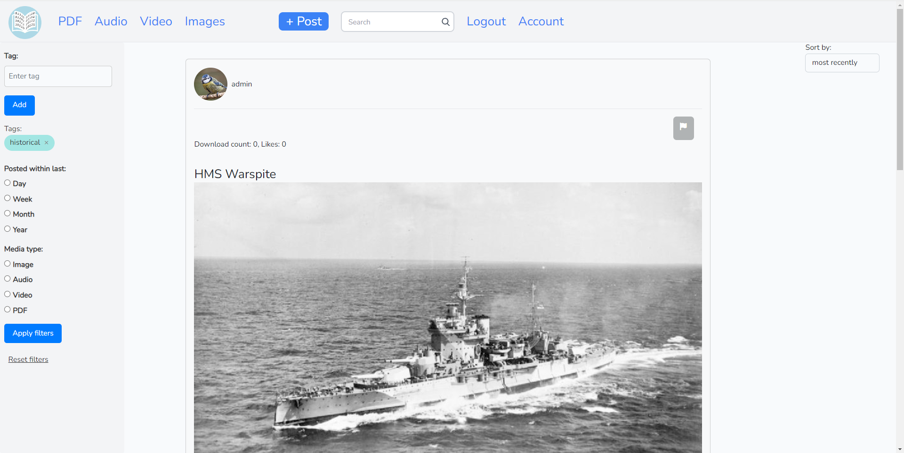
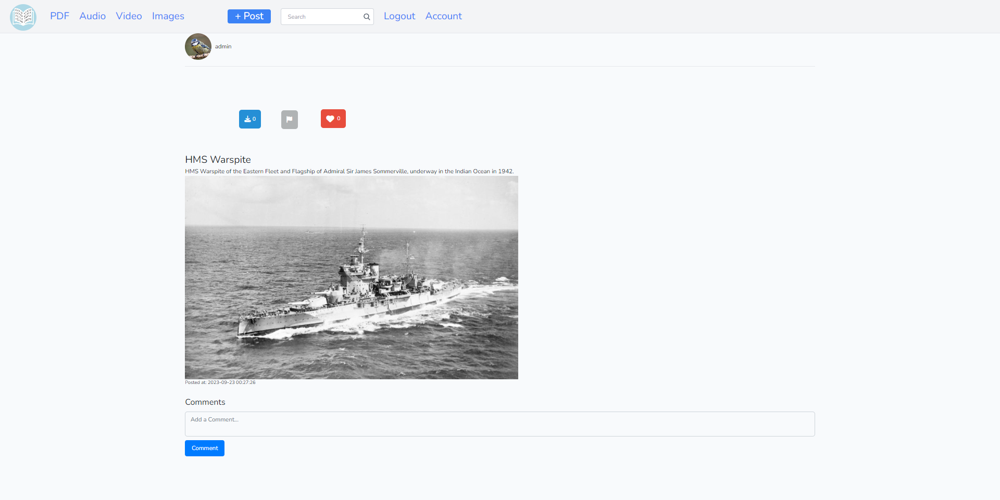
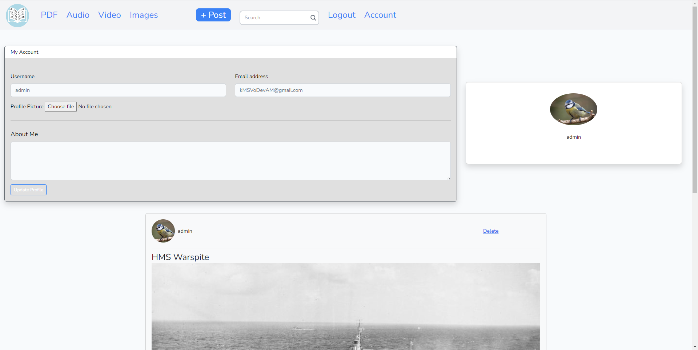

# OpenDigital

Social media web app which hosts public domain content. Supports images, videos, audio and PDF. Has tagging, sorting/filtering, commenting, liking, downloading, flagging/moderation page, login/registration and account management features. See "Setup guide.docx"

This GitHub repositiory has been imported from an original private repository. No development was done on GitHub.

